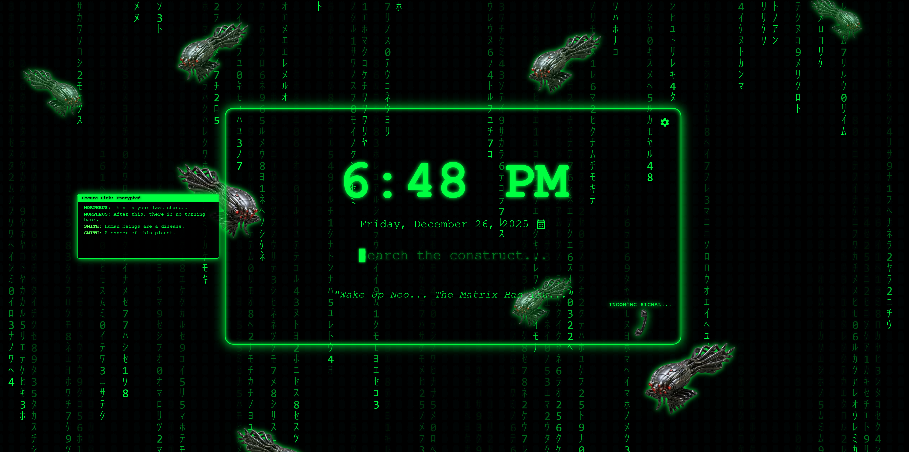

\# Neo's New Tab (Matrix-Inspired Dashboard)

A Matrix-themed Chrome extension that replaces your New Tab page with a digital rain terminal, a functional search bar, and a secure "Phone Link" system.

\## 🛠 Installation (Manual)

Since this is a fan-made project not on the Chrome Web Store, follow these steps:

1\. \*\*Download\*\* this repository as a ZIP file and extract it.

2\. Open Chrome and navigate to `chrome://extensions`.

3\. Toggle \*\*Developer mode\*\* (top right corner).

4\. Click \*\*Load unpacked\*\* and select the folder containing the extension files.

5\. Open a new tab and enjoy the construct.

⚡ Features
🟢 Visuals & Aesthetics
🧮 The Matrix Rain: A high-performance canvas engine with customizable speed, colors, and character sets (including classic Katakana and Binary).

🛸 Sentinel Swarm: Custom fan-art overlays of Sentinel drones that drift through the digital rain for a deep "Construct" feel.

🖥️ Terminal UI: A minimalist search bar that mimics a command-line interface, complete with a syncing terminal cursor.

🕰️ Dynamic Clock: A retro-futuristic clock and date display with 12/24-hour modes and customizable glow effects.

📞 The Transmission System
☎️ Incoming Signal: An interactive "Phone Link" that rings at randomized intervals.

🤖 Robotic System Voice: If no audio is provided, the browser uses the Web Speech API to read out iconic "Matrix" transmissions in a deep, robotic tone.

🎵 Custom MP3 Triggers: Upload your own audio clips via the settings menu! The system will randomly pick your clips to play when the "link" is established.

⚙️ Customization & Privacy
🛠️ Deep Settings Menu: Control everything from UI scale and text size to "Glitch" intensity and scanline overlays.

💾 Local Storage: All your preferences and uploaded audio files are stored locally in your browser (IndexedDB). No data ever leaves your computer.

🌈 Themes: Toggle between classic Matrix Green, Cyan Cyberpunk, or a shifting Rainbow mode.

\## ⚠️ Disclaimer

This is a non-commercial fan project created for aesthetic purposes. It is not affiliated with, endorsed by, or sponsored by Warner Bros. or the creators of The Matrix franchise.

